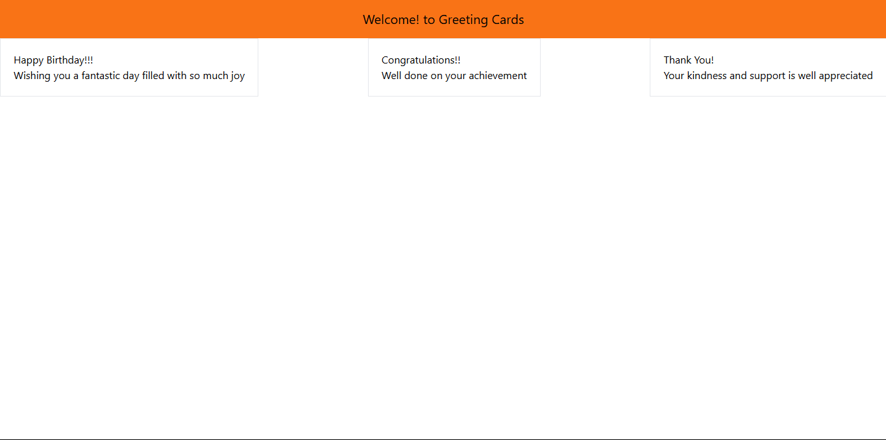

# Greeting Cards Application

Built a React application named "Greeting Cards" using Vite and Tailwind CSS. The project features reusable components, including Header, GreetingCard, and App, demonstrating a modular and clean UI design. Gained experience in efficiently scaffolding projects with Vite, styling functional components with Tailwind CSS, and dynamically rendering content through props.

